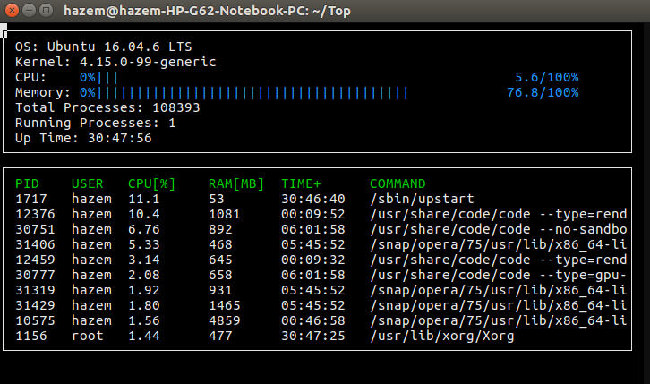

# Top

top like monitor system

## Dependancies

- to run this project you need g++ version 11 or higher
- and you have to install the following library

- `sudo apt install libncurses5-dev libncursesw5-dev`

## Make

This project uses [Make](https://www.gnu.org/software/make/). The Makefile has four targets:

- `build` compiles the source code and generates an executable
- `format` applies [ClangFormat](https://clang.llvm.org/docs/ClangFormat.html) to style the source code
- `debug` compiles the source code and generates an executable, including debugging symbols
- `clean` deletes the `build/` directory, including all of the build artifacts

## Instructions

1. Clone the project repository: `git clone https://github.com/HazemGabr232/Top.git`

2. Build the project: `make build`

3. Run the resulting executable: `./build/monitor`
